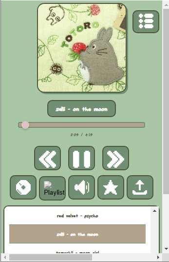

# Mizu Player 🎵

Mizu Player é um aplicativo de música simples e funcional, desenvolvido como projeto pessoal para praticar habilidades de front-end. O player permite ao usuário escutar suas músicas favoritas, navegar pelas faixas e controlar o volume, tudo com uma interface limpa e responsiva.

<h2>📸 Capturas de Tela</h2>

<p align="center">
   
   
</p>


## ⚙️ Funcionalidades

- Reprodução de músicas locais
- Suporte a capas personalizadas
- Tema customizável
- Renomear músicas diretamente pelo player
- Interface minimalista e responsiva

## 🚀 Tecnologias Utilizadas

- [Electron](https://www.electronjs.org/)
- HTML5, CSS3 e JavaScript Vanilla
- Node.js

## 📦 Instalação

1. Clone o repositório:
   ```bash
   git clone https://github.com/romanticbat/mizu-player.git
   cd mizu-player